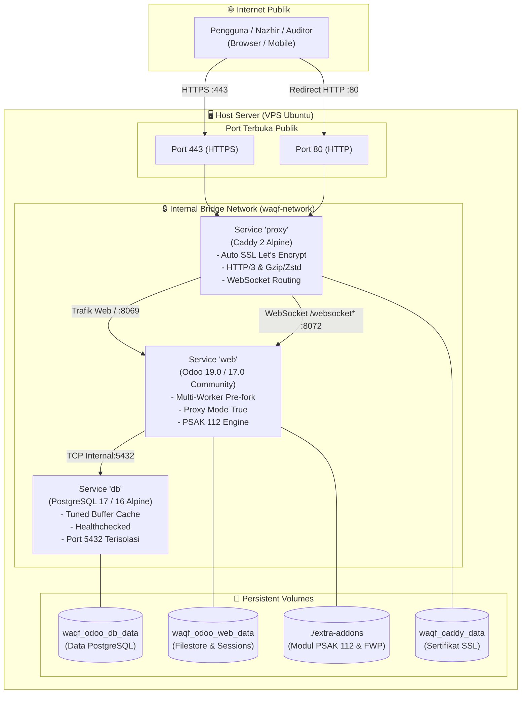

# 🕌 Waqf Odoo Docker

> **Paket Instalasi Turnkey (1-Click Ready-to-Deploy) Sistem ERP Wakaf Berstandar PSAK 412 (PSAK 112) & LSP BWI**  
> Inisiatif kolaboratif **Forum Wakaf Produktif (FWP / [fwp.or.id](https://fwp.or.id))** bersama **Asosiasi Nazhir Indonesia (ANI / [ani.or.id](https://ani.or.id))** untuk kemandirian, transparansi, dan tata kelola Nazhir di seluruh Indonesia.

[](https://www.odoo.com)
[](https://www.postgresql.org)
[](https://caddyserver.com)
[%20%7C%20LSP%20BWI-059669)](https://www.bwi.go.id)
[](https://fwp.or.id)
[](https://docs.docker.com/compose/)
[](LICENSE)

---

## 📋 Daftar Isi
1. [Latar Belakang & Visi Proyek](#-latar-belakang--visi-proyek)
2. [Arsitektur Sistem](#-arsitektur-sistem)
3. [Spesifikasi Server Minimum](#-spesifikasi-server-minimum)
4. [Panduan Cepat: Deploy Odoo Wakaf dalam 5 Menit](#-panduan-cepat-deploy-odoo-wakaf-dalam-5-menit)
5. [Struktur Repositori](#-struktur-repositori)
6. [Fitur Keamanan & Performa Produksi](#-fitur-keamanan--performa-produksi)
7. [Ekosistem Modul Wakaf FWP & ANI](#-ekosistem-modul-wakaf-fwp--ani)
8. [Manajemen Operasional & Pemeliharaan](#-manajemen-operasional--pemeliharaan)
   - [Perintah Docker Harian](#perintah-docker-harian)
   - [Otomasi Backup Harian (Cron Job)](#otomasi-backup-harian-cron-job)
   - [Pemulihan Data Bencana (Disaster Recovery)](#pemulihan-data-bencana-disaster-recovery)
   - [Pembaruan Modul Wakaf](#pembaruan-modul-wakaf)
9. [Troubleshooting & Tanya Jawab](#-troubleshooting--tanya-jawab)
10. [Kontribusi & Lisensi](#-kontribusi--lisensi)

---

## 🌟 Latar Belakang & Visi Proyek

Pengelolaan wakaf di Indonesia menuntut akuntabilitas publik yang tinggi sesuai amanat **UU No. 41 Tahun 2004 tentang Wakaf**, standar akuntansi **PSAK 412: Akuntansi Wakaf** (sebelumnya diterbitkan sebagai **PSAK 112** pasca-rekodifikasi SAK Syariah oleh IAI), serta standar kompetensi kerja **LSP BWI (Badan Wakaf Indonesia)**.

Banyak lembaga Nazhir di daerah memiliki keterbatasan dalam membangun infrastruktur TI mandiri dan sering terkendala biaya lisensi software komersial yang mahal. Oleh karena itu, **Forum Wakaf Produktif (FWP)** dan **Asosiasi Nazhir Indonesia (ANI)** berkolaborasi menghadirkan **`waqf-odoo-docker`** sebagai solusi instalasi instan (*turnkey package*). Paket ini memungkinkan Nazhir menyewa VPS Linux standar (Ubuntu 22.04/24.04), menjalankan satu perintah inisialisasi, dan langsung memiliki sistem ERP Wakaf siap produksi yang:

- **Efisien**: Dioptimasi khusus untuk VPS ekonomis (4 GB – 8 GB RAM).
- **Aman**: Isolasi port internal, proteksi pemilih database, dan sertifikat SSL otomatis.
- **Patuh Syariah**: Terintegrasi langsung dengan modul akuntansi wakaf **PSAK 412 / 112** dan tata kelola Nazhir tersertifikasi **LSP BWI**.

---

## 🏛️ Arsitektur Sistem

Sistem dirancang dengan topologi 3-tier terisolasi yang mengedepankan keamanan dan kecepatan:



---

## 💻 Spesifikasi Server Minimum

Paket ini dirancang agar dapat beroperasi secara stabil pada konfigurasi perangkat keras ekonomis:

| Komponen | Spesifikasi Minimum | Rekomendasi Produksi |
| :--- | :--- | :--- |
| **Sistem Operasi** | Ubuntu 22.04 LTS / 24.04 LTS | Ubuntu 24.04 LTS / Debian 12 |
| **vCPU** | 2 Core | 4 Core |
| **RAM** | 4 GB (*wajib Swap 2 GB*) | 8 GB RAM |
| **Penyimpanan** | 25 GB SSD / NVMe | 50 GB NVMe |
| **Jaringan** | 1 IPv4 Publik statis | 1 IPv4 Publik statis |
| **Akses Domain** | 1 Subdomain (misal: `erp.nazhirwakaf.id`) | DNS A-Record mengarah ke IP VPS |

---

## ⚡ Panduan Cepat: Deploy Odoo Wakaf dalam 5 Menit

### Langkah 1: Kloning Repositori ke VPS
Masuk ke terminal server VPS Anda via SSH, lalu kloning repositori ini:
```bash
git clone https://github.com/forumwakafproduktif/waqf-odoo-docker.git /opt/waqf-odoo
cd /opt/waqf-odoo
```

### Langkah 2: Jalankan Inisialisasi Otomatis
Jalankan skrip `init-setup.sh`. Skrip ini akan secara otomatis:
1. Memeriksa ketersediaan Docker dan Docker Compose.
2. Mendeteksi RAM dan membuat **Swap File 2 GB** jika belum tersedia (mencegah server crash).
3. Meng-generate kata sandi acak yang kuat untuk Database dan Master Admin Odoo ke dalam file `.env`.
4. Mengonfigurasi file `config/odoo.conf` secara otomatis.
5. Menyiapkan folder modul dan hak akses direktori.

```bash
chmod +x init-setup.sh
sudo ./init-setup.sh
```

### Langkah 3: Sesuaikan Domain & Email SSL
Buka file `.env` menggunakan teks editor:
```bash
nano .env
```
Ubah dua parameter berikut:
```env
DOMAIN_NAME=erp.nazhiranda.or.id
ACME_EMAIL=admin@nazhiranda.or.id
```
*(Pastikan subdomain `erp.nazhiranda.or.id` sudah diarahkan melalui DNS A-Record ke IP server VPS Anda).*

### Langkah 4: Jalankan Service Docker
Nyalakan seluruh service dengan satu perintah:
```bash
docker compose up -d
```
Pantau proses peluncuran container:
```bash
docker compose logs -f
```
Tunggu hingga muncul pesan `odoo.modules.loading: Modules loaded` dan `Caddy: certificate obtained successfully`.

### Langkah 5: Inisiasi Database Odoo Wakaf
1. Buka peramban (browser) dan akses:
   ```text
   https://erp.nazhiranda.or.id/web/database/manager
   ```
2. Masukkan **Master Password** yang telah digenerate (lihat di baris `ADMIN_PASSWORD` pada file `.env`).
3. Buat database baru:
   - **Database Name**: misal `waqf_prod`
   - **Email / Login**: email administrator Anda
   - **Password**: password login admin Anda
   - **Language**: *Indonesian / Bahasa Indonesia*
   - **Country**: *Indonesia*
4. Klik **Create Database**. Selamat! Sistem ERP Wakaf Anda sudah aktif dan terenkripsi SSL A+.

---

## 📂 Struktur Repositori

```text
waqf-odoo-docker/
├── .env.example              # Template variabel lingkungan (kredensial, port, tuning)
├── .gitignore                # Filter file sensitif, backup, dan cache
├── docker-compose.yml        # Konfigurasi orkestrasi 3-tier (db: postgres 17, web: odoo 19, proxy)
├── Dockerfile                # Image Odoo 19 + dependensi PSAK 112 (num2words, openpyxl, qrcode)
├── init-setup.sh             # Skrip automasi 1-klik provisioning server
├── config/
│   ├── odoo.conf             # Konfigurasi Odoo 19 / 17 (multi-worker, tuning, PSAK 112)
│   ├── odoo.conf.template    # Template konfigurasi untuk injeksi variabel env
│   └── Caddyfile             # Konfigurasi Caddy reverse proxy, Auto-SSL & WebSocket
├── extra-addons/             # Folder modul ekosistem Wakaf FWP (mounted ke Odoo)
│   ├── .gitkeep
│   └── README.md             # Panduan instalasi modul custom
└── scripts/
    ├── backup.sh             # Skrip backup harian (Postgres + Filestore + Rclone offsite)
    ├── restore.sh            # Skrip pemulihan bencana (Disaster Recovery)
    └── download-modules.sh   # Skrip pembantu unduh/update modul wakaf FWP
```

---

## 🛡️ Fitur Keamanan & Performa Produksi

### 1. Isolasi Port (Zero Host Exposure)
Port PostgreSQL (`5432`) dan port internal Odoo (`8069`, `8072`) **tidak dibuka** ke internet publik. Hanya container Caddy yang mendengarkan port `80` dan `443` di host. Semua komunikasi antar-service berlangsung melalui bridge network virtual terenkapsulasi `waqf-network`.

### 2. Proteksi Pemilih Database (`list_db = False`)
Pada server produksi publik, pemilih database dimatikan (`list_db = False`). Pengunjung umum tidak dapat melihat daftar database atau mencoba meretas database manager. Akses pemeliharaan database hanya dapat diakses melalui URL spesifik `/web/database/manager` dengan otentikasi Master Password.

### 3. Penanganan WebSocket Odoo 17 yang Sempurna
Odoo 17 memisahkan trafik Web (`8069`) dan WebSocket (`8072`) saat berjalan dalam mode multi-worker. Konfigurasi Caddyfile pada repositori ini telah dikonfigurasi secara spesifik:
```caddy
handle /websocket* {
    reverse_proxy web:8072 {
        header_up Host {host}
        header_up X-Real-IP {remote_host}
        header_up X-Forwarded-For {remote_host}
        header_up X-Forwarded-Proto {scheme}
    }
}
```
Hal ini memastikan fitur notifikasi real-time, live chat, dan modul discuss tidak pernah mengalami pemutusan koneksi (*WebSocket handshake dropped*).

### 4. Multi-Worker Tuning & Pencegahan OOM Crash
Dikonfigurasi untuk VPS 4 GB - 8 GB RAM dengan formula:
- **Workers**: 4 worker proses + 1 cron thread.
- **Memory Soft Limit**: 2048 MB (peringatan daur ulang).
- **Memory Hard Limit**: 2560 MB (terminasi paksa sebelum mengganggu PostgreSQL).
- **Execution Timeout**: 600–1200 detik untuk memastikan perhitungan laporan buku besar akuntansi wakaf tahunan berjalan tuntas tanpa terputus timeout HTTP.

---

## 🧩 Ekosistem Modul Wakaf FWP & ANI

Direktori `./extra-addons` disiapkan untuk memuat modul-modul resmi hasil kolaborasi Forum Wakaf Produktif (FWP) dan Asosiasi Nazhir Indonesia (ANI):

| Modul | Standar Acuan | Fungsi Utama |
| :--- | :--- | :--- |
| **`waqf_core`** | UU No. 41/2004 & LSP BWI | Master Data Wakif, Mauquf 'Alaih, Akta Ikrar Wakaf (AIW/APAIW), legalitas sertifikat tanah wakaf. |
| **`l10n_id_waqf_psak112`** | PSAK 412 / 112 (IAI) | Bagan Akun Standar Akuntansi Wakaf (COA), Laporan Posisi Keuangan, Laporan Rincian Aset Wakaf, Laporan Aktivitas, Laporan Arus Kas, dan Catatan atas Laporan Keuangan (CALK). |
| **`waqf_cash`** | Fatwa DSN-MUI & BWI | Tata kelola Wakaf Uang, penempatan portofolio syariah (CWLS, SBSN, Deposito Mudharabah). |
| **`waqf_property`** | BWI, FWP & ANI | Tata kelola Wakaf Produktif (Tanah, Ruko, Rumah Sakit), pengelolaan aset sewa dan pemeliharaan. |
| **`waqf_distribution`** | Syariah & UU Wakaf | Distribusi surplus hasil pengelolaan wakaf ke penerima manfaat serta alokasi hak nazhir (maks. 10%). |

Untuk mengunduh modul-modul tersebut, cukup jalankan:
```bash
./scripts/download-modules.sh
```

---

## 🛠️ Manajemen Operasional & Pemeliharaan

### Perintah Docker Harian
| Kebutuhan | Perintah |
| :--- | :--- |
| Memeriksa status container | `docker compose ps` |
| Melihat log seluruh service | `docker compose logs -f` |
| Melihat log Odoo saja | `docker compose logs -f web` |
| Merestart service Odoo | `docker compose restart web` |
| Menghentikan seluruh service | `docker compose down` |
| Menjalankan kembali di latar belakang | `docker compose up -d` |

---

### Otomasi Backup Harian (Cron Job)
Sistem dilengkapi skrip pencadangan otomatis `scripts/backup.sh` yang melakukan dump basis data PostgreSQL sekaligus mengompresi filestore Odoo ke dalam format `.tar.gz`, serta menghapus backup yang berusia lebih dari 7 hari.

Uji coba backup manual:
```bash
./scripts/backup.sh
```

Untuk menjadwalkan backup otomatis setiap hari pukul **02.00 dini hari**:
1. Buka crontab:
   ```bash
   crontab -e
   ```
2. Tambahkan baris berikut di bagian paling bawah:
   ```cron
   0 2 * * * cd /opt/waqf-odoo && ./scripts/backup.sh >> /var/log/waqf_backup.log 2>&1
   ```

#### Dukungan Upload Offsite (Google Drive / S3 / R2):
Anda dapat mengaktifkan backup offsite menggunakan `rclone`. Cukup isi variabel `RCLONE_REMOTE` pada file `.env`:
```env
RCLONE_REMOTE=gdrive_fwp
RCLONE_DEST_PATH=WaqfBackups
```

---

### Pemulihan Data Bencana (Disaster Recovery)
Jika terjadi insiden atau migrasi server, Anda dapat memulihkan seluruh data (database dan filestore dokumen) hanya dengan satu perintah:
```bash
./scripts/restore.sh backups/waqf_backup_YYYYMMDD_HHMMSS.tar.gz
```
Skrip akan meminta konfirmasi `YA` sebelum menimpa data demi mencegah kesalahan operasional.

---

### Pembaruan Modul Wakaf
Jika tim FWP merilis pembaruan pada modul akuntansi PSAK 112:
1. Jalankan skrip pembaruan modul:
   ```bash
   ./scripts/download-modules.sh
   ```
2. Restart service Odoo:
   ```bash
   docker compose restart web
   ```
3. Di web browser: Buka **Apps** -> klik **Update Apps List** -> klik **Upgrade** pada modul yang diperbarui.

---

## ❓ Troubleshooting & Tanya Jawab

<details>
<summary><b>1. Browser menampilkan pesan "Not Secure" atau sertifikat SSL gagal terbit?</b></summary>
<br>
Pastikan domain yang Anda masukkan di <code>.env</code> sudah memiliki DNS A-Record yang benar-benar mengarah ke IP publik VPS Anda. Caddy membutuhkan akses ke port 80 dan 443 terbuka dari luar untuk menyelesaikan tantangan ACME Let's Encrypt. Periksa log Caddy dengan:
<pre><code>docker compose logs proxy</code></pre>
</details>

<details>
<summary><b>2. Fitur Chat / Discuss sering muncul tulisan "Connection Lost"?</b></summary>
<br>
Ini biasanya disebabkan oleh proxy yang tidak meneruskan request <code>/websocket</code> ke port <code>8072</code>. Pastikan Anda menggunakan file <code>config/Caddyfile</code> dan <code>config/odoo.conf</code> bawaan repositori ini, serta pastikan nilai <code>proxy_mode = True</code> aktif.
</details>

<details>
<summary><b>3. Server mendadak lambat atau container Database mati (Killed / Out of Memory)?</b></summary>
<br>
Pada VPS dengan RAM 4 GB, Odoo dapat menghabiskan memori saat mengompilasi laporan keuangan besar. Pastikan Swap Memory aktif dengan memeriksa perintah <code>free -h</code>. Jika Swap 0, jalankan kembali <code>sudo ./init-setup.sh</code> untuk mengaktifkan Swap 2 GB.
</details>

<details>
<summary><b>4. Bagaimana cara mengubah Master Password Odoo di kemudian hari?</b></summary>
<br>
Ubah nilai <code>ADMIN_PASSWORD</code> di dalam file <code>.env</code>, lalu jalankan kembali <code>./init-setup.sh</code> untuk mensinkronkannya ke <code>config/odoo.conf</code>, kemudian restart Odoo:
<pre><code>docker compose restart web</code></pre>
</details>

---

## 🤝 Inisiator & Kontribusi

Proyek ini bersifat sumber terbuka (Open-Source) di bawah lisensi **LGPL-3.0**. Diinisiasi secara kolaboratif oleh:
- **Forum Wakaf Produktif (FWP)** – [fwp.or.id](https://fwp.or.id)
- **Asosiasi Nazhir Indonesia (ANI)** – [ani.or.id](https://ani.or.id)
- **Didukung oleh Standar Kompetensi**: LSP Badan Wakaf Indonesia (BWI)

Kami mengundang developer, akuntan syariah, akademisi, dan praktisi wakaf di seluruh Indonesia untuk berkontribusi.
- **Laporkan Masalah / Permintaan Fitur**: Silakan buat *Issue* atau *Pull Request* pada repositori ini.

---
*Semoga menjadi amal jariyah bagi para kontributor dan memudahkan seluruh Nazhir di Indonesia mengelola amanah wakaf secara profesional, akuntabel, dan transparan.*
